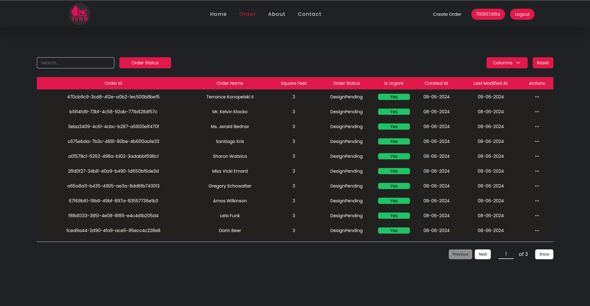
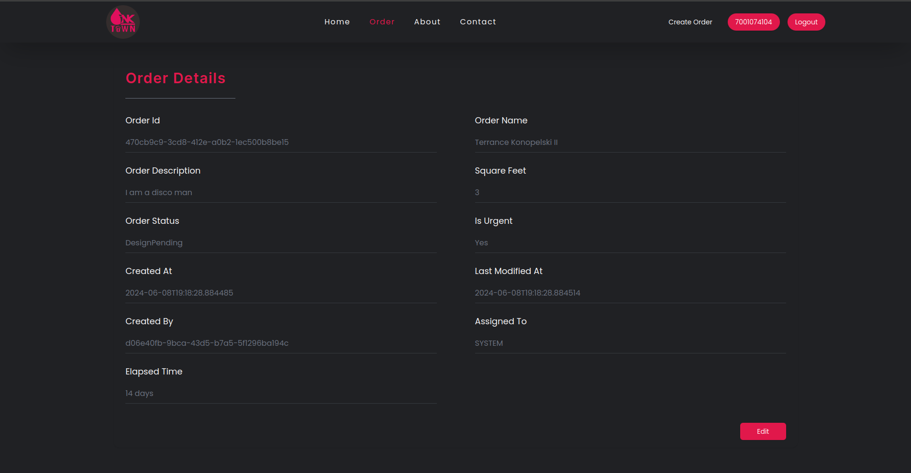
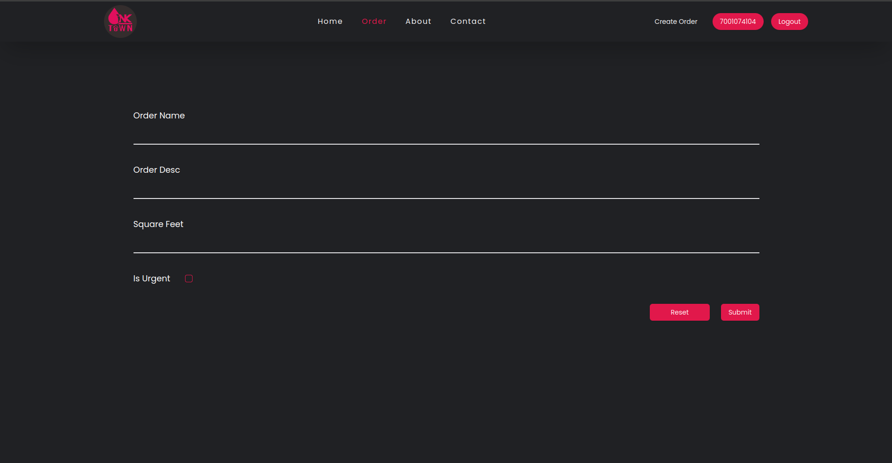
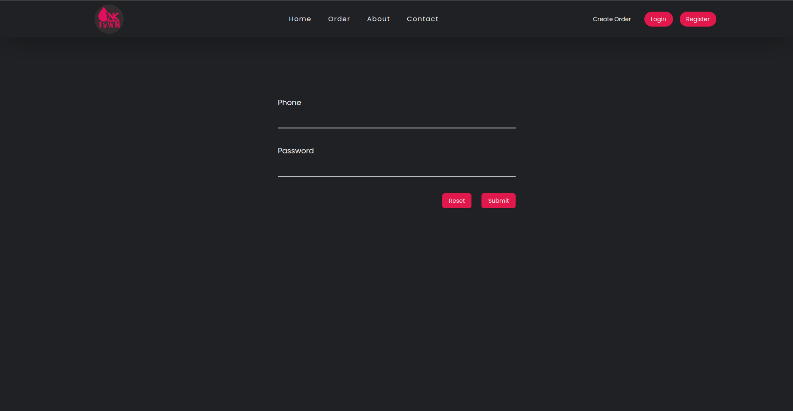

# PressioUI
A front end repository for Pressio

Pressio is a web application that helps to track orders for printing press. This application provides a user friendly interface to manage orders. It allows users to create, update, and delete orders. Users can also view details of individual orders.

## Diffrent Sections
#### Home

#### Order_Page

#### Order_Details_Page

#### Create_Order_Page

#### Login_Page

